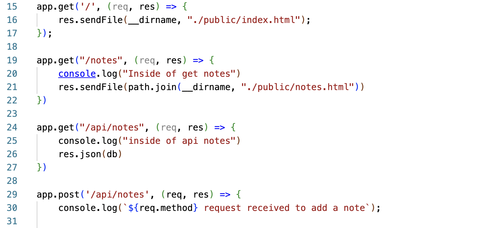

# express-note-taker

##  Description
This application utilizes both the frontend and backend. It is deployed on heroku and the deployed applicaiton link is below. This application is a note generating application. You can open the link and type in notes to save. It can also open past notes or delete past notes. 

[Deployed Application](https://express-note-taker12.herokuapp.com/)

##  Table of Contents
* [Installation](#installation)
* [Usage](#usage)
* [License](#license)
* [Contributing](#contributing)
* [Questions](#questions)

##  Installation
Express must be installed to run the tests and prompts.  

##  Usage
This application is deployed on Heroku and utilizes the server.js file to connect the frontend and backend. 

## License
This is licensed under the MIT license.

##  Contributing
[w3schools](https://www.w3schools.com/) 
[Stack Overflow](https://stackoverflow.com/?newreg=8cd9776f072c449eac02d1ab363597c8)

##  Questions
If you have any questions about the repo, feel free to email me at chelseaburnham0@gmail.com. You can find more of my work at [http://github.com/chelseaburnham].